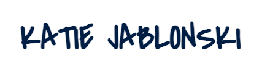

I wear many hats depending on the situation. I am first and foremost, a passionate learner and a full stack developer. 

<h2>I've Worked With</h2>
<h6>Languages</h6>

<h6>Frameworks</h6>

<h6>DataBases</h6>

<h6>Tools</h6>

<h6>Currently Learning</h6>

  
<h2>Connect</h2>

  

